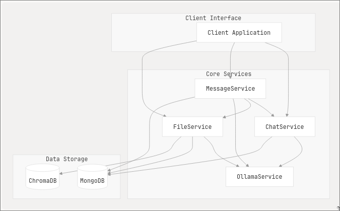

# Backend 3DOM

## Технологии
+ Python(FastAPI)
+ MongoDB
+ ChromaDB
+ Ollama
+ Docker (docker-compose)

## Архитектура
4 микросервиса REST API
Внутри каждый микросервис представляет сервер приложение построенное на принципах чистой архитектуры с разделением слоев и общими сущностями.

## Схема

## Swagger DOCS
+ *file-service*: https://giicoo.ru/api/file-service/docs
+ *message-service*: https://giicoo.ru/api/message-service/docs
+ *chat-service*: https://giicoo.ru/api/chat-service/docs
+ *ollama-service*: https://giicoo.ru/api/ollama-service/docs

### Endpoints

## Как используется

Базовое использование:
1. Создается чат `/create-auto` с автоматически сгенерированным названием по первому запросу.
2. Используя `id` созданного чата, создаем сообщение пользователя `/message` POST. 
3. Генерируется ответ LLM модели объявленной в chat и стримится, конечный сообщением является `[DONE]`
4. Полностью сгенерированный ответ отправляем в создание сообщения, но уже с `role:"assistant"`.

Другие сценарии:
- Открываем чат, получая все сообщения по chat_id `/messages`. Новые сообщения как и в безовом использовании.
- Загружаем файл pdf `/uploadfile/` и используем его в контексте следующих сообщений (RAG с использованием файлов)

### Ветвление:
Все сообщения имеют `parent_id` и представляют собой древо, где корень это сообщение с `parent_id=null`

Так как при генерации помодели история сообщений воссдается от какого-либо сообщения, поднимаясь вверх по древу и добавляя только parent messages, появляется возможность использовать разную историю сообщений при разных ветках (также учивая прикрепленные файлы к разным веткам) `/messages-branch`

Пример схема: 

        __________________________________________
            |id=1; parent_id=null|

                        /     \ 

        |id=2; parent_id=1|  |id=3; parent_id=1|
                |
        |id=4; parent_id=2| 

        __________________________________________
        
        Если get_branch_messages(4):
        1. Получаем id=4
        2. По parent_id=2 получаем id=2
        3. По parent_id=1 получаем id=1

        Возвращаем [id=1, id=2, id=4]
        __________________________________________

### RAG pdf

Загружается pdf файл, разделяется на страницы, из них достают текст. Этот текст делят на чанки по 500 символов с наложением по 50 для большей связи. `/uploadfile/`

Каждый отдельный чанк вначала сохраняют в MongoDB получая их id, а это id уже вместе с embeddings(векторное представление текст) сохраняют в ChromaDB(векторную базу данных)

*Как получают контекст*: 
Есть какой-то промт, он тоже получает свой embedding, с помощью него находят самые ближайшие по смыслу сохраненные чанки и используют их в контексте при генерации сообщений `/get-context`
